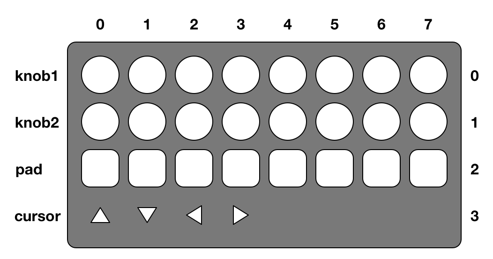

# launchcontrol-message-parser
[](https://travis-ci.org/mohayonao/launchcontrol-message-parser)
[](https://www.npmjs.org/package/@mohayonao/launchcontrol-message-parser)
[](http://mohayonao.mit-license.org/)

## Installation

```sh
npm install @mohayonao/launchcontrol-message-parser
```

## Example

```js
const parser = require("@mohayonao/launchcontrol-message-parser");

launchControl.onmidimessage = (e) => {
  const items = parser.parse(e.data);
  // → { col: 0, row: 0, val: 100, ch: 0 }

  if (items.col === 0 && items.row === 0) {
    console.log(`knob1-0: ${ items.val }`);
  }
};
```

## Data Matrix



## License

MIT
